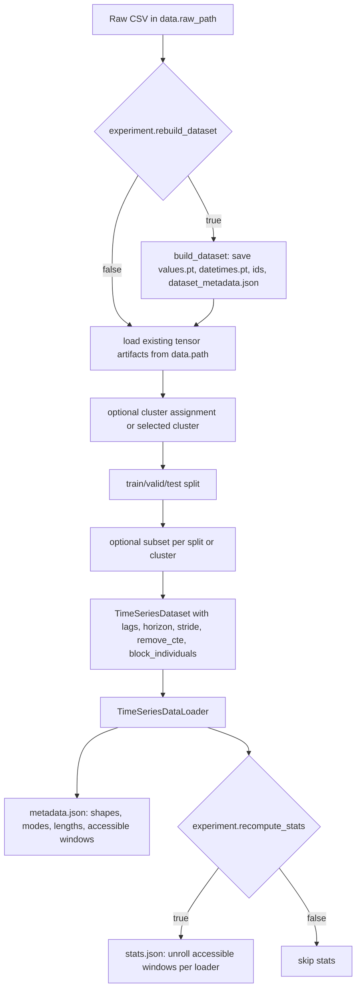

# timetensors

Time series forecasting experiments built around Hydra overrides, PyTorch
models, tensorized datasets, and Slurm benchmark scripts.

## Entrypoints

Run commands from the repository root so relative paths resolve against this
folder.

```bash
python -m timetensors.experiment  # dataset build, train, and eval orchestration
python -m timetensors.load_dataset # build/load tensor dataset artifacts only
python -m timetensors.train_model  # train only
python -m timetensors.eval_model   # evaluate only
```

Example:

```bash
python -m timetensors.experiment \
  +data.raw_path="../datasets/electricity" \
  +data.path="../datasets/electricity" \
  +data.name=electricity \
  +experiment.rebuild_dataset=true \
  +task.lags=168 \
  +task.horizon=24 \
  +model.name=dlinear \
  +model.path=dlinear \
  +normalization.name=instance \
  +training.batch_size=256 \
  +training.epochs=200 \
  +output.dir=outputs/timetensor_models/electricity/168_24 \
  +output.name=dlinear
```

## Config Reference

Hydra is used with no config file by default, so most runs pass values as
`+section.key=value` overrides. Nested dictionaries can be passed with dot
paths, for example `+data.sampling.eval_stride=24`.

The sections below document the canonical package specs.

### `data`

Dataset input/output and tensor-building options.

| Key | Default | Description |
| --- | --- | --- |
| `data.path` | `run/dataset` | Directory containing tensor artifacts such as `values.pt`; also the output directory when rebuilding. |
| `data.raw_path` | `.` | Directory containing `<data.name>.csv` when rebuilding. |
| `data.name` | required for rebuild | CSV stem used as `<data.raw_path>/<data.name>.csv`. |
| `data.prefix` | `""` | Prefix for tensor files, producing `<prefix>_values.pt`, etc. |
| `data.legacy_context_kind` | unset | Interpret legacy `context.pt` as `individual` or `global`. |
| `data.save_loaded_copy` | `false` | Re-save loaded tensors to `data.path`. |
| `data.prepare_loaders` | `true` | Build train/eval loaders during dataset stage. |

CSV-building options used only when `experiment.rebuild_dataset=true`:

| Key | Default | Description |
| --- | --- | --- |
| `data.global_context_cols` | unset | CSV columns moved into global context. |
| `data.drop_users` | unset | Series/columns to drop. |
| `data.drop` | unset | Additional CSV columns or rows to drop. |
| `data.build_individual_ids_context` | `false` | Add individual IDs as individual context. |
| `data.rename_cols` | unset | Mapping of source column names to display names. |
| `data.aggr` | unset | Resample aggregation: `sum`, `mean`, `last`, `first`, or `asfreq`. |
| `data.aggr_period` | `h` | Pandas resampling period. |
| `data.users_dim` | `1` | `1` means series are columns; `0` means series are rows. |
| `data.date_col` | unset | CSV date column to parse and use as index. |
| `data.dates` | unset | Explicit dates replacing the CSV index. |

### `data.splits` or top-level `splits`

Controls train/validation/test temporal and individual splits.

| Key | Default | Description |
| --- | --- | --- |
| `date_splits` | `[0.6,0.2,0.2]` | Temporal split ratios; one to three positive values summing to 1. |
| `indiv_split` | `1.0` | Fraction of individuals kept per split. |
| `shuffle_individuals` | `true` | Randomize individual split membership. |
| `by_cluster` | unset | Per-cluster overrides. |

### `data.sampling` or top-level `sampling`

Controls how dataset items are sampled from split tensors.

| Key | Default | Description |
| --- | --- | --- |
| `train_idx_mode` | `individuals` | Train sampler mode. |
| `eval_idx_mode` | `all` | Eval sampler mode. |
| `train_stride` | `1` | Step between train candidate start dates. |
| `eval_stride` | `1` | Step between eval candidate start dates. |
| `shuffle_train` | `true` | Shuffle train loader. |
| `shuffle_eval` | `false` | Shuffle eval loaders. |
| `remove_train_cte` | `false` | Remove constant train windows. |
| `remove_eval_cte` | `false` | Remove constant eval windows. |
| `train_block_individuals` | `1` | Individuals returned in each train item. |
| `eval_block_individuals` | `1` | Individuals returned in each eval item. |
| `train_len_multiplier` | `1` | Multiplier for train sampler length. |
| `eval_len_multiplier` | `1` | Multiplier for eval sampler length. |
| `use_context` | `true` | Legacy switch for both context types. |
| `use_individual_context` | `true` | Include individual context in batches. |
| `use_global_context` | `true` | Include global context in batches. |

Valid sampler modes are `random`, `dates`, `individuals`, and `all`.
For `idx_mode=all`, the split dataset length is the number of accessible
`(individual, date)` windows after stride and constant-window filtering. The
dataloader length is the number of batches, i.e. `ceil(dataset_length /
batch_size)`.

### `data.subsets` or top-level `subsets`

Optional subsampling on top of train/eval splits.

| Key | Default | Description |
| --- | --- | --- |
| `mode` | sampler mode | Subset mode for all splits. |
| `modes.<split>` | unset | Per-split subset mode. |
| `sizes.<split>` | `1.0` | Ratio of candidates to keep for a split. |
| `specs.<split>` | unset | Precomputed indices or `{mode, indices, stride}`. |
| `by_cluster` | unset | Per-cluster overrides. |

Valid subset modes are `dates`, `individuals`, and `all`.

### `task`

| Key | Default | Description |
| --- | --- | --- |
| `task.lags` | `168` | Lookback/context length. |
| `task.horizon` | `24` | Forecast horizon. |

### `training`

| Key | Default | Description |
| --- | --- | --- |
| `training.batch_size` | `256` | Batch size. If it exceeds a split dataset length, PyTorch returns one smaller batch. |
| `training.epochs` | `200` | Training epochs; `0` skips optimization but still saves/evaluates. |
| `training.loss` | `nmse` | Training loss config. |
| `training.complete_evaluation` | `true` | Include extra eval metrics beyond `mse` and `nmse`. |
| `training.lr` | `1e-5` | Learning rate. |
| `training.optimizer` | `adam` | Optimizer name. |
| `training.optimizer_kwargs` | `{}` | Extra optimizer kwargs. |
| `training.grad_clip` | unset | Max gradient norm. |
| `training.log_every_steps` | `1000` | Log recent train loss every N optimizer steps. Also logs at step 1 and the final step. |
| `training.eval_every_steps` | `100` | Run validation loaders every N optimizer steps. Also evaluates at step 1 and the final step. |
| `training.device` | `auto` | Device selector: `auto`, `gpu`, `cuda`, or `cpu`. `gpu`/`cuda` fail if CUDA is unavailable; `auto` falls back to CPU. |
| `training.eval_runs` | `1` | Validation passes during training. |
| `training.pretrained_path` | unset | Model state dict path. |

Optimizers: `adam`, `adamw`, `sgd`, `rmsprop`.

During training, validation is run without resetting the seed so random
training loaders keep their sequence between evaluation passes.

Loss names: `mse`, `mae`, `nmse`, `nmae`, `rmse`.
Loss dictionaries may use `name`, `base`, `scaling`, `reduction`, `eps`, and
`kwargs`. Base losses are `mse` and `mae`; scalings are `normal` and
`relative_mean`.

### `model`

| Key | Default | Description |
| --- | --- | --- |
| `model.name` | `model.path` or `linear` | Run/model name. |
| `model.path` | `model.name` | Built-in model key, import path, `module:attr`, or `.py` file. |
| `model.specs` | unset | Path to a model YAML file; bypasses inline model fields. |
| `model.class` | unset | Class name when loading from a Python file. |
| `model.kwargs` | `{}` | Constructor kwargs. |
| `model.state_dict_path` | unset | State dict to load. |
| `model.repeat_constant` | `false` | Repeat last value for constant lookbacks. |
| `model.covariate_augmentation` | unset | Covariate augmentation config. |

Built-in model keys:

`persistence`, `expected`, `repeat`, `lookback`, `linear`,
`periodic_linear`, `dlinear`, `patchtst`, `chronos`, `tabpfn`.

Inline model kwargs automatically receive `lags`, `dim`, and `horizon` where
needed.

Chronos and TabPFN are optional SOTA wrappers. They use the normal
`TimeTensorModel` path, including normalization, structured covariates, and
constant-output handling. Install the optional dependencies before using them:

```bash
pip install -e ".[sota]"
```

Useful SOTA kwargs:

| Model | Kwarg | Meaning |
| --- | --- | --- |
| `chronos` | `weights_path` | Local Chronos-2 weights directory. If unset, the wrapper first checks the new package path, then the legacy `timetensors_old` path. |
| `chronos` | `cross_learning` | Forwarded to `pipeline.predict(...)`. |
| `chronos` | `shared_context` | Treat context batches as shared across forecast samples. |
| `chronos` | `device_map` | Chronos loading device map, usually `cuda` or `cpu`. |
| `chronos` | `context_mode` | `structured`, `past_only`, or `future_included`. |
| `tabpfn` | `weights_path` | Local TabPFN checkpoint path. If unset, the wrapper first checks the new package path, then the legacy `timetensors_old` path. |
| `tabpfn` | `cross_learning` | Fit one tabular regressor over the whole batch instead of one fit per sample. |
| `tabpfn` | `dimension_encoding` | `ordinal` or `one-hot` series identity features. |
| `tabpfn` | `context_as_features` | Use future-known covariates as tabular features instead of extra training rows. |
| `tabpfn` | `use_time_features` | Add normalized time index and seasonal sine/cosine features. |
| `tabpfn` | `context_mode` | `structured`, `past_only`, or `future_included`. |

### `model.covariate_augmentation`

| Key | Default | Description |
| --- | --- | --- |
| `modes` | none | Augmentation modes. A dash-separated string is accepted for simple transforms, or use a list of structured specs. |
| `kwargs.target` | `past_only` | `past_only` appends generated covariates only over the lookback. `future_included` creates generated covariates over lookback plus horizon and splits them into past/future entries. |
| `kwargs.noise_scale` | `1.0` | Scale for `noise` mode. |
| `kwargs.constant_value` | `1.0` | Value for `constant` mode. |
| `kwargs.kernel_size` | `5` | Odd smoothing kernel size for `kernel` mode. |
| `kwargs.eps` | `1e-8` | Numerical epsilon. |

Modes: `identity`, `square`, `root`, `sign`, `mirror`, `kernel`, `noise`,
`constant`. For repeated noise or constant covariates with explicit values, use
structured specs:

```bash
+model.covariate_augmentation.modes='[{name:noise,count:3,value:1.0,target:past_only}]'
+model.covariate_augmentation.modes='[{name:constant,count:2,value:0.0,target:future_included}]'
+model.covariate_augmentation.modes='[{name:noise,count:2,value:0.1,target:past_only},{name:constant,count:1,value:1.0,target:future_included}]'
```

Each spec accepts `name`, `count`, `value`, and optional `target`.
`target` defaults to `model.covariate_augmentation.kwargs.target`.

### `normalization`

| Key | Default | Description |
| --- | --- | --- |
| `normalization.name` | `identity` | Normalization applied inside `TimeTensorModel`. |
| `normalization.kwargs` | `{}` | Constructor kwargs for the normalization. |
Canonical normalization names. Only these names are accepted:

| Name | Meaning | Important kwargs |
| --- | --- | --- |
| `identity` | No normalization. | none |
| `standard` | Global `(x - mean) / std`. | `mean`, `std`, `eps` |
| `min-max` | Global min-max scaling. | `min_value`, `max_value`, `eps` |
| `in-min-max` | Per-instance min-max scaling. | `eps`, `detach_stats` |
| `instance` | RevIN with `affine=false`. Kept as a convenient name because it is a common baseline. | `eps`, `center`, `detach_stats`, `transform` |
| `revin` | Reversible instance normalization. Variants such as last-value centering, arcsinh transform, and affine/no-affine are kwargs, not separate names. | `affine`, `center`, `transform`, `eps`, `detach_stats`, `dim` |
| `grevin` | Generalized RevIN with learnable partial centering/scaling and output restoration. | `eps`, `center`, `start_in`, `tie_revin`, `personalize`, `n_clusters`, `init_from_stats`, `stats_split` |
| `cmin` | Grevin preset with instance normalization frozen and output `alpha,beta` trainable. | `n_clusters`, `init_from_stats`, `stats_split` |
| `previn` | Personalized RevIN preset with per-cluster affine parameters. | `n_clusters`, `unknown_cluster_id` |
| `sigmoid` | Sigmoid transform with logit inverse. | `eps` |
| `tanh` | Tanh transform with inverse hyperbolic tangent. | `eps` |
| `relative_mean` | Scale by absolute instance mean. | `eps`, `detach_stats` |
| `rms` | Scale by instance root-mean-square. | `eps`, `detach_stats` |

RevIN examples:

```bash
+normalization.name=revin
+normalization.kwargs.affine=false

+normalization.name=revin
+normalization.kwargs.center=last

+normalization.name=revin
+normalization.kwargs.transform=arcsinh
```

`arcsinh` means inverse hyperbolic sine. The code uses `torch.asinh`
internally because that is PyTorch's function name, but the config spelling is
`arcsinh`.

Grevin stats initialization uses loader statistics from the selected split:

```bash
+normalization.name=cmin
+normalization.kwargs.n_clusters=4
+normalization.kwargs.init_from_stats=true
```

### `experiment`

| Key | Default | Description |
| --- | --- | --- |
| `experiment.rebuild_dataset` | `false` | Build CSV/raw data into tensor artifacts before training/eval. |
| `experiment.recompute_stats` | `true` | Compute and save final-loader numerical statistics such as average lookback mean/std and alpha/beta. |
| `experiment.stats_max_windows` | unset | Optional maximum accessible windows to sample per loader for stats. Unset means all accessible windows. |
| `experiment.stats_seed` | `experiment.seed` | RNG seed used only when `stats_max_windows` samples a subset. |
| `experiment.stats_eps` | `1e-8` | Epsilon used in alpha/beta denominators. |
| `experiment.prepare_loaders` | `data.prepare_loaders` or `true` | Build loaders during dataset stage. |
| `experiment.evaluate` | `true` | Run evaluation after training/skipping training. |
| `experiment.skip_training` | `false` | Skip training stage. |
| `experiment.bypass_training_with_pretrained` | `true` | Skip training if pretrained state is supplied. |
| `experiment.pretrained_path` | unset | State dict path. |
| `experiment.seed` | unset | Random seed. |

### `evaluation`

| Key | Default | Description |
| --- | --- | --- |
| `evaluation.splits` | all loader splits | Split name or list of split names to evaluate. |
| `evaluation.runs` | `1` | Repeated evaluation passes for final evaluation. |
| `evaluation.plot_example` | `false` | Save an example prediction plot. |
| `evaluation.example_plot_path` | `<run_dir>/example_prediction.png` | Optional path for the example prediction plot. |

### `output`

| Key | Default | Description |
| --- | --- | --- |
| `output.dir` | `outputs` | Parent output directory. |
| `output.name` | `model.name` | Run directory name under `output.dir`. |

The run directory is:

```text
<output.dir>/<output.name>/
```

Saved artifacts include `model_state.pt`, `train_history.pt`,
`train_metadata.pt`, `criterion_loss.png`, `all_losses.pt`,
`per_user_all_losses.pt`, and optionally `example_prediction.png`.

### `misc`

| Key | Default | Description |
| --- | --- | --- |
| `misc.log_level` | `INFO` | Python logging level. |

### Hydra

Hydra's own job directory is separate from TimeTensor's `output.dir`.

```bash
hydra.run.dir='outputs/hydra/${now:%Y-%m-%d}/${now:%H-%M-%S}'
```

Use single quotes or escape the `$` in `${now:...}` when writing Bash/Slurm
scripts, otherwise Bash tries to expand `now`.

## Dataset Layout

The Slurm scripts expect CSVs and built tensors in the same dataset directory:

```text
../datasets/
  electricity/
    electricity.csv
    values.pt
    datetimes.pt
    individual_ids.pt
    date_ids.pt
    dataset_metadata.json
```

`experiment.rebuild_dataset=true` writes the tensor files into `data.path`.
Set `REBUILD_DATASETS=false` for Slurm runs when tensors already exist.

## Data Flow

The pipeline keeps tensor build metadata separate from final-loader statistics.
Metadata describes what was built or selected. Stats are numerical averages
computed only after the final loaders exist.



Run-specific loader artifacts are saved under:

```text
<output.dir>/<output.name>/dataset_artifacts/
  metadata.json
  stats.json
```

`metadata.json` is hierarchical. It records dataset shapes, cluster creation or
loading, split creation or loading, subset/sampling modes, loader lengths,
potential windows, accessible windows, and windows removed by `remove_cte`.

`stats.json` is per final loader. A loader means the final combination of
cluster, split, subset, and sampling spec. Stats therefore change when `lags`,
`horizon`, subset, stride, split, cluster, or constant-window filtering changes.
They do not depend on draw order. For example, a train loader with
`train_idx_mode=individuals` and runtime length `1` still computes stats over all
accessible `(individual, date)` windows unless `experiment.stats_max_windows`
limits the scan.

Stats currently include counts plus averaged lookback/future mean and std,
`alpha = future_std / (lookback_std + eps)`, and
`beta = (future_mean - lookback_mean) / (lookback_std + eps)`. If
`experiment.stats_max_windows` is set, a reproducible random subset of
accessible windows is used; otherwise the scan is deterministic and exhaustive.

## Slurm Scripts

Scripts live in `timetensors/slurm/` and define experiment launchers for Slurm
clusters. They use these shell variables:

| Variable | Default | Description |
| --- | --- | --- |
| `DATA_ROOT` | `../datasets` in scripts | Parent dataset directory. |
| `OUT_ROOT` | per-script `outputs/...` | Parent output directory. |
| `REBUILD_DATASETS` | `true` | Rebuild tensors for the first run of each dataset. |
| `RECOMPUTE_STATS` | `true` | Recompute L/H-dependent stats for each run. |
| `STATS_MAX_WINDOWS` | unset | Optional cap forwarded to `experiment.stats_max_windows`. |
| `SEED` | `1` where used | Experiment seed. |
| `SOTA_BATCH_SIZE` | `350` in SOTA scripts | Evaluation batch size for Chronos/TabPFN. |
| `PATCHTST_BATCH_SIZE` | `256` | PatchTST batch size in `benchmark_sota_compare.slurm`. |
| `PATCHTST_EPOCHS` | `200` | PatchTST training epochs in `benchmark_sota_compare.slurm`. |
| `CHRONOS_WEIGHTS_PATH` | unset | Optional Chronos local weights directory. |
| `CHRONOS_DEVICE_MAP` | `cuda` | Chronos loading device map. |
| `TABPFN_WEIGHTS_PATH` | unset | Optional TabPFN checkpoint path. |
| `TABPFN_DEVICE` | `cuda` | TabPFN regressor device. |

`benchmark_chronos_covariates.slurm` defines explicit augmentation specs in
its `AUGMENTS` array, including mixed `past_only` and `future_included` runs.

Submit from the repository root in a Slurm environment:

```bash
sbatch timetensors/slurm/benchmark_models.slurm
REBUILD_DATASETS=false sbatch timetensors/slurm/benchmark_models.slurm
sbatch timetensors/slurm/benchmark_sota_compare.slurm
sbatch timetensors/slurm/benchmark_chronos_covariates.slurm
```

## Smoke Tests

Lightweight component tests live in `tests/`. They exercise config defaults,
synthetic dataloaders, and model construction.

```bash
python tests/test_config_defaults.py
python tests/test_dataloaders.py
python tests/test_models.py
```

These scripts build tiny synthetic tensors in temporary folders and avoid Slurm,
large datasets, and long training runs.

## Device Logging

The project pins `torch==2.5.1` to avoid resolving to newer CUDA 13-era Torch
wheels that may require newer NVIDIA drivers than the cluster provides.

Training and evaluation log the selected device to stdout, which appears in
`script_outputs/*.out` for Slurm jobs:

```text
device requested=gpu resolved=cuda:0 cuda=True
```

If `resolved=cpu` or `cuda_available=False`, PyTorch did not find a usable GPU
inside that job. Slurm scripts pass `+training.device=gpu`, so CUDA problems
fail fast with diagnostics instead of silently training on CPU.
