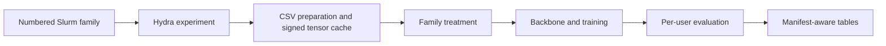

# Code architecture

TimeTensors is the reference trainable forecasting benchmark. The paper-ready
formulation is in [`method_overview.pdf`](../latex/method_overview.pdf).

## Package ownership

| Owner | Responsibility |
|---|---|
| `src/data/` | Portable CSV loading, prepared variants, splits, windows, and samplers |
| `src/proposal/` | GRevIN and project-specific normalization mechanisms |
| `src/external_models/` | Pinned DLinear/PatchTST and thin foundation adapters |
| `src/model_loading/` | Common model construction and wrappers |
| `src/training/` | Optimization, losses, and per-user evaluation |
| `src/pipeline/` | Family configuration, manifests, and reusable run selection |
| `src/results/` | Seed aggregation and row-scaled tables |
| `src/visualization/` | Training, prediction, and coefficient plots |

## Execution path

1. A numbered front selects one scientific family.
2. Its family shell declares the treatment axes and calls shared orchestration.
3. The data layer loads or builds the exact signed prepared variant.
4. Training completes only missing seeds for the selected configuration.
5. Tables consume completed manifests and write aggregate reports.

## Important boundaries

- Dataset preparation applies exclusions once; tensor consumers never repeat it.
- CSV NaNs are zero-filled by default after aggregation; `missing_values=error`
  rejects them. Infinite raw values and non-finite prepared caches are rejected.
- A family varies only its declared treatment while common training controls
  remain fixed.
- Proposal code does not import Slurm, manifests, results, or plotting.
- Foundation-model evaluation is frozen and does not enter the training loop.
